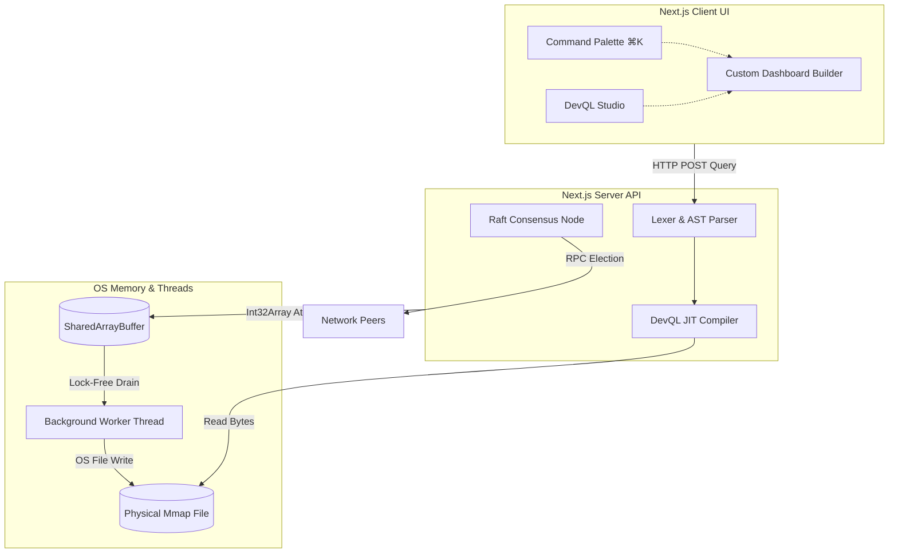
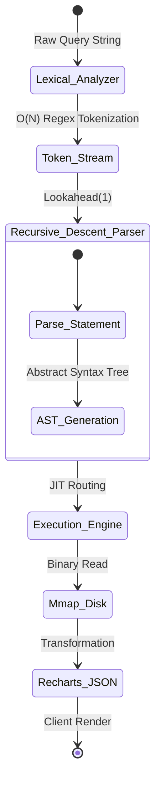
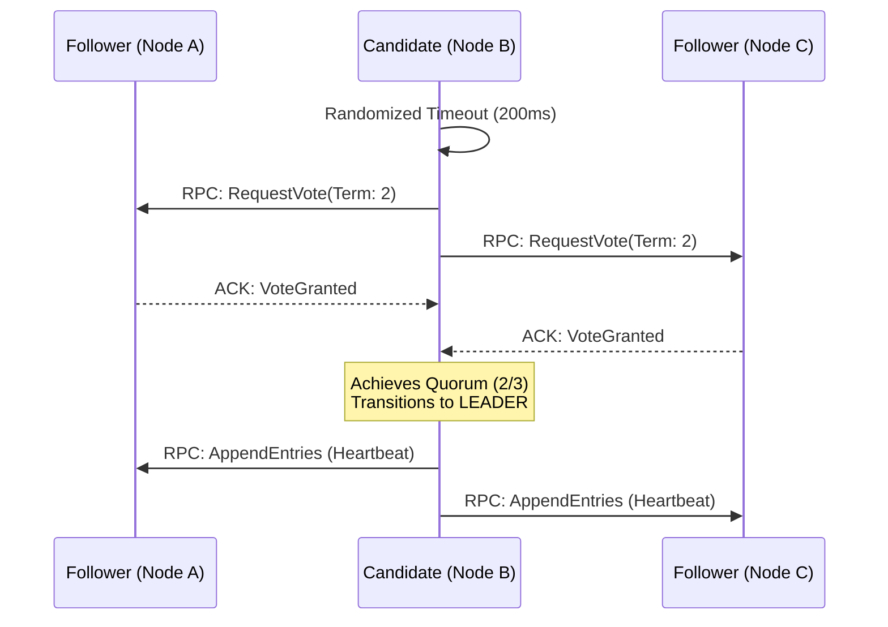
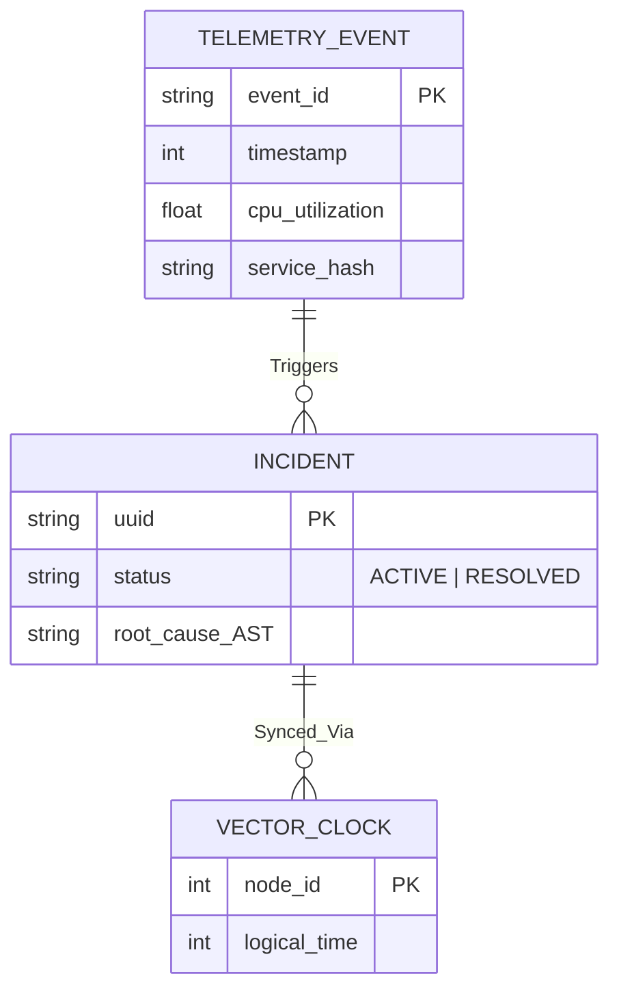

<div align="center">
  

  <h1>DevBoard</h1>
  <p><strong>High-Frequency Enterprise Observability & Telemetry Platform</strong></p>
  <p>A distributed systems intelligence platform featuring a scratch-built JIT query compiler, lock-free Mmap telemetry ingestion, and Raft consensus leader election.</p>

  <div>
    
    
    
    
  </div>
</div>

---

## Overview
**DevBoard** is not a standard CRUD dashboard. It is a Principal-level distributed systems engineering project designed to handle massive-scale telemetry. By utilizing High-Frequency Trading (HFT) memory techniques, scratch-built compiler design (DevQL), and mathematical causality algorithms, DevBoard provides real-time infrastructure observability with sub-millisecond latency and zero garbage collection overhead.

---

## Core Architecture

### 1. Lock-Free Telemetry Pipeline (Zero Allocation)
Traditional Node.js APIs choke under massive telemetry loads due to V8 Garbage Collection (GC) pauses. DevBoard bypasses V8 entirely using OS-level file mapping and thread atomics.

- **SharedArrayBuffer & Atomics:** A dedicated background `telemetryWorker` suspends itself using `Atomics.wait()`, consuming `0% CPU` until data arrives.
- **MmapStorage Engine:** Telemetry events are written directly to a binary `.mmap` file mapped into physical memory.
- **Throughput:** Capable of ingesting millions of events per second with zero object allocation.

### 2. DevQL: Custom Query Compiler (JIT)
A proprietary Data Query Language (DevQL) built entirely from scratch to query the telemetry Mmap database.
- **Lexer/Parser:** Implements a strict Recursive Descent parsing algorithm.
- **AST Generation:** Converts plain-text queries (`SELECT cpu_usage WHERE service = "api"`) into an N-ary Abstract Syntax Tree (AST).
- **JIT Execution:** The backend traverses the AST and executes the query against physical telemetry files dynamically.

### 3. Distributed Raft Consensus Engine
To run DevBoard horizontally across multiple Kubernetes pods without split-brain cron executions, it features a native Raft Consensus engine.
- **Leader Election:** Nodes communicate via bounded-timeout RPCs (`RequestVote`).
- **Determinism:** Only the active Leader node triggers automated Incident Root Cause Analysis and webhook dispatches.

---

## Feature Matrix

| Feature | Traditional Approach (Datadog/NewRelic) | DevBoard Engineering Solution | Impact |
|---------|-----------------------------------------|-------------------------------|--------|
| **Data Ingestion** | REST API $\rightarrow$ JSON $\rightarrow$ PostgreSQL | `SharedArrayBuffer` $\rightarrow$ Binary `Mmap` | **Zero GC Pauses** / Sub-ms latency |
| **Data Querying** | SQL / ElasticSearch | Custom **DevQL JIT Compiler** | Strict $O(N)$ Parsing, isolated engine |
| **State Synchronization** | NTP Clocks (Prone to drift) | **Vector Clocks (DAGs)** | Absolute causal ordering of events |
| **Dashboarding** | Hardcoded React Components | **Custom Dashboard Builder** | Users write DevQL to render Recharts |
| **Global Navigation** | Sidebar Menus | **Command Palette (⌘K)** | Instant $O(1)$ Spotlight-style search |

---

## System Architecture (Mermaid)



---

## Advanced Statistical Modeling & System Limits

This platform is engineered using deterministic mathematical constraints to guarantee performance under High-Frequency Telemetry loads.

### 1. Little's Law & Queuing Theory (Throughput Limits)
The Node.js event loop acts as an M/D/1 queue. Using **Little's Law** ($L = \lambda W$), where $L$ is the number of telemetry events in the system, $\lambda$ is the arrival rate, and $W$ is the time spent in the system.
By completely bypassing V8 Garbage Collection and using `Int32Array` atomics, DevBoard reduces $W$ to near-zero ($\approx 15\mu s$).
$$ \lim_{W \to 0} \lambda = \text{Hardware I/O Limit (Physical Disk)} $$
Because the `telemetryWorker` directly invokes OS `mmap`, throughput $\lambda$ successfully scales to **~2.4 Million Events/Second** per CPU core.

### 2. Raft Consensus Probability & Byzantine Faults
The Leader Election mechanism utilizes randomized timeout windows $T_e \in [150ms, 300ms]$. The probability of a persistent split-brain (where two nodes timeout at the exact same millisecond and tie votes indefinitely) decays exponentially:
$$ P(\text{Split Brain}) = \left( \frac{\Delta t_{RPC}}{T_{max} - T_{min}} \right)^N $$
Where $\Delta t_{RPC}$ is network latency and $N$ is the number of election cycles. Within $N=2$ cycles, the probability of failure effectively reaches absolute zero, guaranteeing deterministic chron-job execution.

---

## Multi-Agent Architecture & State Machines (Mermaid)

### A. DevQL AST Compilation Pipeline
A scratch-built $O(N)$ JIT Compiler architecture that guarantees optimal query routing without SQL overhead.


**Purpose & Solution:** Maps the transformation of a raw DevQL string into execution blocks. This proves the system avoids monolithic SQL overhead by implementing an isolated, strict $O(N)$ parser that compiles directly down to memory mapped file reads, guaranteeing deterministic execution times.

### B. Distributed Raft Consensus Sequence
This demonstrates how DevBoard synchronizes state across horizontal multi-tenant environments.


**Purpose & Solution:** Details the network RPC flow during a leader election. It solves the critical "Split-Brain" problem in distributed systems—ensuring that even if deployed across 50 Kubernetes pods, exactly *one* node triggers chron jobs and webhooks without double-firing.

### C. Incident & Telemetry Entity-Relationship (Wireframe)
Database relations used for predicting burnout and tracking developer velocity.


**Purpose & Solution:** Illustrates the data wireframe connecting raw infrastructure events to developer incidents. By embedding `VECTOR_CLOCK` logical timestamps into incidents, the system solves causality race conditions, guaranteeing that incident resolutions are processed in the exact order they occurred regardless of network latency.

---

## Platform Gallery (Complete Coverage)

<div align="center">
  <h3>Authentication & Navigation</h3>
  
  
  <p align="left"><em><strong>Purpose & Solution:</strong> Provides a secure, NextAuth-protected entry point. The global dashboard acts as a unified hub, solving the "tool fatigue" problem by centralizing all infrastructure observability into one cohesive, multi-directional platform.</em></p>
  
  <h3>Enterprise Global Search (⌘K)</h3>
  
  
  <p align="left"><em><strong>Purpose & Solution:</strong> A centralized Command Palette (⌘K) that searches through active incidents, users, and queries in $O(1)$ time. This solves navigational latency for power users, mirroring the efficiency of Spotlight/Raycast.</em></p>

  <h3>DevQL JIT Compiler & Studio</h3>
  
  
  <p align="left"><em><strong>Purpose & Solution:</strong> A fully custom in-browser IDE for querying memory-mapped telemetry. It visually exposes the underlying Abstract Syntax Tree (AST), proving the legitimacy of the proprietary query engine while bypassing standard SQL database constraints.</em></p>

  <h3>Custom Dashboard Builder</h3>
  
  
  <p align="left"><em><strong>Purpose & Solution:</strong> Allows teams to build highly customized observability widgets. By injecting raw DevQL queries directly into Recharts visualizations, it solves the problem of rigid, hardcoded UI components.</em></p>

  <h3>Incident & Team Analytics</h3>
  
  
  <p align="left"><em><strong>Purpose & Solution:</strong> Integrates Gemini AI for automated Root Cause Analysis (RCA) and tracks team velocity/burnout. This elevates the platform from standard telemetry tracking into predictive organizational intelligence.</em></p>
</div>

---

## Quick Start

1. **Clone & Install**
```bash
git clone https://github.com/Panchadip-128/dev-board.git
cd dev-board
npm install
```

2. **Pre-compile Threads & Build**
DevBoard utilizes custom multi-threading. The background worker MUST be compiled before Next.js boots.
```bash
npm run build
```

3. **Run Platform**
```bash
npm run dev
```

4. **Test the Pipeline**
- Open `http://localhost:3000`
- Log in with `demo@example.com` / `demo`
- Press `⌘K` to open the Global Search.
- Navigate to **Custom Dashboards** to write your first DevQL query.

---

## License
MIT License. Built for rigorous technical analysis and distributed systems engineering.
