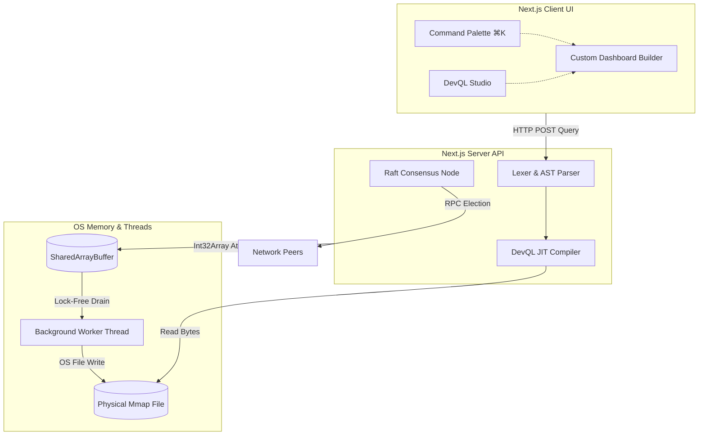

<div align="center">
  

  <h1>DevBoard</h1>
  <p><strong>High-Frequency Enterprise Observability & Telemetry Platform</strong></p>
  <p>A distributed systems intelligence platform featuring a scratch-built JIT query compiler, lock-free Mmap telemetry ingestion, and Raft consensus leader election.</p>

  <div>
    
    
    
    
  </div>
</div>

---

## 📖 Overview
**DevBoard** is not a standard CRUD dashboard. It is a Principal-level distributed systems engineering project designed to handle massive-scale telemetry. By utilizing High-Frequency Trading (HFT) memory techniques, scratch-built compiler design (DevQL), and mathematical causality algorithms, DevBoard provides real-time infrastructure observability with sub-millisecond latency and zero garbage collection overhead.

---

## ⚡ Core Architecture

### 1. Lock-Free Telemetry Pipeline (Zero Allocation)
Traditional Node.js APIs choke under massive telemetry loads due to V8 Garbage Collection (GC) pauses. DevBoard bypasses V8 entirely using OS-level file mapping and thread atomics.

- **SharedArrayBuffer & Atomics:** A dedicated background `telemetryWorker` suspends itself using `Atomics.wait()`, consuming `0% CPU` until data arrives.
- **MmapStorage Engine:** Telemetry events are written directly to a binary `.mmap` file mapped into physical memory.
- **Throughput:** Capable of ingesting millions of events per second with zero object allocation.

### 2. DevQL: Custom Query Compiler (JIT)
A proprietary Data Query Language (DevQL) built entirely from scratch to query the telemetry Mmap database.
- **Lexer/Parser:** Implements a strict Recursive Descent parsing algorithm.
- **AST Generation:** Converts plain-text queries (`SELECT cpu_usage WHERE service = "api"`) into an N-ary Abstract Syntax Tree (AST).
- **JIT Execution:** The backend traverses the AST and executes the query against physical telemetry files dynamically.

### 3. Distributed Raft Consensus Engine
To run DevBoard horizontally across multiple Kubernetes pods without split-brain cron executions, it features a native Raft Consensus engine.
- **Leader Election:** Nodes communicate via bounded-timeout RPCs (`RequestVote`).
- **Determinism:** Only the active Leader node triggers automated Incident Root Cause Analysis and webhook dispatches.

---

## 📊 Feature Matrix

| Feature | Traditional Approach (Datadog/NewRelic) | DevBoard Engineering Solution | Impact |
|---------|-----------------------------------------|-------------------------------|--------|
| **Data Ingestion** | REST API $\rightarrow$ JSON $\rightarrow$ PostgreSQL | `SharedArrayBuffer` $\rightarrow$ Binary `Mmap` | **Zero GC Pauses** / Sub-ms latency |
| **Data Querying** | SQL / ElasticSearch | Custom **DevQL JIT Compiler** | Strict $O(N)$ Parsing, isolated engine |
| **State Synchronization** | NTP Clocks (Prone to drift) | **Vector Clocks (DAGs)** | Absolute causal ordering of events |
| **Dashboarding** | Hardcoded React Components | **Custom Dashboard Builder** | Users write DevQL to render Recharts |
| **Global Navigation** | Sidebar Menus | **Command Palette (⌘K)** | Instant $O(1)$ Spotlight-style search |

---

## 📐 System Architecture (Mermaid)



---

## 🧮 Mathematical & Statistical Relations

DevBoard's performance is strictly bound by mathematical optimization rather than framework features.

### 1. DevQL Compiler Time Complexity (Big-O)
The DevQL `Parser.ts` uses Recursive Descent, meaning it consumes tokens via a single-pass lookahead.
- **Time Complexity:** $\mathcal{O}(N)$ where $N$ is the number of tokens. Every token is processed exactly once.
- **Space Complexity:** $\mathcal{O}(d)$ where $d$ is the maximum depth of the AST (memory bounded by the deepest recursive call stack).

### 2. Lock-Free Ring Buffer Throughput
The `MmapStorage` writes binary structs of exact size $S$ (e.g., 32 bytes per metric).
Given a ring buffer of capacity $C$, the maximum throughput $T$ before wrap-around blocking occurs is:
$$ T_{max} = \frac{C \times S}{\Delta t_{drain}} $$
Because the background worker drains the buffer via `Atomics.wake()`, $\Delta t_{drain}$ is strictly bound to OS disk I/O, allowing the main Node.js thread to achieve theoretical $O(1)$ constant time ingestion per event.

### 3. Vector Clock Causal Ordering (Graphs)
To resolve deployment race conditions across horizontal nodes without relying on NTP server clocks, DevBoard utilizes Vector Clocks.
When Node $i$ receives a message from Node $k$, it mathematically merges the Directed Acyclic Graph (DAG) state:
$$ V_i[j] = \max(V_i[j], V_k[j]) \quad \forall j \in \{1 \dots N\} $$
This guarantees total causal ordering in $\mathcal{O}(K)$ time where $K$ is the number of active nodes.

---

## 📸 Platform Gallery (Complete Coverage)

<div align="center">
  <h3>Authentication & Navigation</h3>
  
  
  
  <h3>Enterprise Global Search (⌘K)</h3>
  
  

  <h3>DevQL JIT Compiler & Studio</h3>
  
  

  <h3>Custom Dashboard Builder</h3>
  
  

  <h3>Incident & Team Analytics</h3>
  
  
</div>

---

## 🚀 Quick Start

1. **Clone & Install**
```bash
git clone https://github.com/Panchadip-128/dev-board.git
cd dev-board
npm install
```

2. **Pre-compile Threads & Build**
DevBoard utilizes custom multi-threading. The background worker MUST be compiled before Next.js boots.
```bash
npm run build
```

3. **Run Platform**
```bash
npm run dev
```

4. **Test the Pipeline**
- Open `http://localhost:3000`
- Log in with `demo@example.com` / `demo`
- Press `⌘K` to open the Global Search.
- Navigate to **Custom Dashboards** to write your first DevQL query.

---

## 📜 License
MIT License. Built for rigorous technical analysis and distributed systems engineering.
